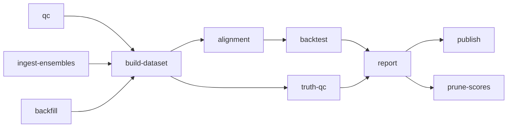

# CLI reference

Complete reference for every command and flag. For a guided first run see
[Getting started](../getting-started.md); for the reasoning behind the pipeline
order see [Advanced usage](../advanced-usage.md).

```
grounded-weather-forecast [--config CONFIG] [--version] <command> [options]
```

The entry point is `grounded_weather_forecast.cli:main`. Once a command has
parsed and its configuration has loaded successfully, its outcome is appended
to the **run ledger** (`data/runs.parquet`, pruned to 90 days / 50k rows), so
`report` can tell you what actually ran. Help, `--version`, parse failures, and
configuration failures occur before ledgering.

---

## Global options

| Flag | Type | Default | Meaning |
|---|---|---|---|
| `--config CONFIG` | path | `config.toml` | path to the TOML configuration |
| `--version` | flag | — | print the version and exit |
| `-h`, `--help` | flag | — | help for the program or a subcommand |

### Exit codes

| Code | Meaning |
|---|---|
| `0` | success |
| `1` | command-level failure — missing inputs, no scores to report, a backfill error |
| `2` | configuration error, or an unknown command |
| `75` | pipeline, dataset-publication, or automatic-recovery lock contention (EX_TEMPFAIL — retry later) |

Note that `truth-qc` returns `0` even when it finds no evaluable checks. A cold
start is not a fault, and an operator's cron should not page on one.

### Concurrency

`build-dataset`, `backtest`, `report`, `alignment`, `backfill`, `truth-qc`, and
`prune-scores` serialize on an exclusive lock at `<dataset dir>/pipeline.lock`.
A second interactive mutator waits up to 60 s, then exits `75`. `maintain`
instead waits indefinitely and holds that lock once across its entire four-step
transaction. `recover` deduplicates itself on `auto-restore.lock`, waits for the
pipeline lock, and rechecks whether work is still necessary before running.

Dataset publication has a separate short `<dataset dir>/dataset.lock`.
`build-dataset` stages every live parquet and the manifest, acquires that lock,
replaces all parquets, then replaces the manifest last. `predict` and `publish`
copy and validate all live files under that lock, waiting up to 60 s before
exiting `75`. Selection and fitting use the pinned in-memory snapshot after
releasing the lock, so serving sees one complete dataset publication. They do not wait
behind an hour-long backtest or report. `ingest-ensembles` keeps its own
store-level lock and runs freely alongside the chain.

---

## Pipeline order

Commands are independent, but they consume each other's outputs. A cold start
runs roughly:



Steady state is four crons — see [Scheduling](../scheduling.md).

---

## `qc`

> summarize station truth quality control

No flags. Reads the station database and prints the observation span, a
per-channel QC summary (samples, nulls, and counts for each of `OUT_OF_BOUNDS`,
`SPIKE`, `FLATLINE`), and hourly/daily non-null truth counts.

**Run this first.** If your column mapping is wrong, this is where it shows up —
as a channel that is 100% null or 100% flagged — and every later command would
otherwise fail confusingly.

*Writes nothing.* See [Methods: truth and QC](../methods/truth-qc.md).

---

## `build-dataset`

> materialize truth tables and supervised matrices as parquet

No flags. The core ingest. Reads both SQLite files, applies QC, builds truth at
all three resolutions, reads the forecast archive into canonical long frames,
constructs as-of snapshots, and writes the supervised matrices.

**Writes** into `[dataset] dir` (default `data/`):

| File | Contents |
|---|---|
| `truth_minute.parquet`, `truth_hourly.parquet`, `truth_daily.parquet` | the aggregation ladder |
| `forecasts_long.parquet`, `daily_long.parquet`, `minutely_long.parquet` | canonical long frames |
| `hourly_matrix_live.parquet` | the supervised live hourly matrix |
| `daily_matrix_live.parquet` | the supervised live daily matrix |
| `manifest.json` | per-file SHA-256 and the **dataset fingerprint** |

The build is byte-reproducible: stable sorts precede every pivot, so the same
inputs give the same fingerprint. That fingerprint is what gates artifact
staleness and what serving checks before trusting a release.

Prints the fingerprint, source list, snapshot count, and per-file row counts with
a 16-character hash.

`build-dataset` does not write synthetic matrices. `backfill` writes
`hourly_matrix_synthetic.parquet` and `daily_matrix_synthetic.parquet` from
archive providers, keeping that provenance separate from live observations.

---

## `backtest`

> rolling-origin backtest over the supervised matrices

| Flag | Choices / type | Default | Meaning |
|---|---|---|---|
| `--methods` | CSV or `all` | `all` | method ids to run; `all` means every registered method |
| `--hourly-variables` | CSV | `temp_c,humidity_pct,dew_point_c,wind_speed_ms,wind_gust_ms,pressure_sea_hpa,precip_mm,pop` | hourly variables to score |
| `--daily-variables` | CSV | `temp_max_c,temp_min_c,pop,precip_sum_mm` | daily variables to score |
| `--products` | CSV of `hourly`,`daily`,`minutely` | `hourly,daily,minutely` | which products to backtest |
| `--window` | `expanding` \| `rolling` | `expanding` | training window mode |
| `--source` | `live` \| `synthetic` | `live` | which provenance the matrices must carry |
| `--semantics` | `auto` \| `inst` \| `mean` | `auto` | hourly truth semantics |

Notes that matter:

- **`minutely` is live-only.** It scores the nine nowcast path constructions, and
  the synthetic archive has no sub-24h leads to score them on.
- **`--source` is a wall, not a filter.** Live and synthetic rows are never
  pooled; mixing raises `MixedProvenanceError`. See
  [Methods: verification §7](../methods/verification.md#7-the-provenance-wall).
- **`--semantics auto`** reads the majority recommendation from
  `artifacts/alignment.json`, falling back to `inst` when no study exists.
  Variables without dual semantics (gust, precip, PoP, daily extremes) always use
  `inst`.
- **`--window`** — `expanding` asks *what do you know?*, `rolling` (180 days)
  asks *what have you learned lately?* Both are reported; they answer different
  questions.

**Writes** `data/scores/scores_{product}_{kind}_{window}_{evaluation_id}.parquet`.
On live sources it then runs method selection and prints the promoted release ids.

---

## `maintain`

> run the scheduled live maintenance transaction under one pipeline lock

| Flag | Choices / type | Default | Meaning |
|---|---|---|---|
| `--methods` | CSV or `all` | `all` | method ids passed to the live backtest |
| `--hourly-variables` | CSV | same as `backtest` | hourly variables passed to the live backtest |
| `--daily-variables` | CSV | same as `backtest` | daily variables passed to the live backtest |
| `--products` | CSV of `hourly`,`daily`,`minutely` | `hourly,daily,minutely` | products passed to the live backtest |
| `--window` | `expanding` \| `rolling` | `expanding` | training window passed to the live backtest |
| `--semantics` | `auto` \| `inst` \| `mean` | `auto` | hourly truth semantics passed to the live backtest |
| `--truth-qc-days` | int > 0 | `30` | neighbour history passed to the final truth-QC step |

The source is always `live`. The command waits for `pipeline.lock`, then runs
`build-dataset` → `backtest --source live` → `report` → `truth-qc` while holding
that one lock. It stops immediately on the first nonzero result, so later steps
never consume a failed predecessor's output.

---

## `report`

> render leaderboards and correlation reports from scores

No flags, and the heaviest command. For every scores file it builds the
leaderboard, applies BH and e-BH multiplicity control, updates the e-process
store, computes MCS winners and winner's-curse corrections, gates promotions,
scores served forecasts against realized truth, and detects drift.

**Writes** into `[reports] dir` (default `reports/`) and `[artifacts] dir`:

| Output | Contents |
|---|---|
| `reports/leaderboard_{product}_{source}_{window}_{hash}.md` | per-slice leaderboards |
| `reports/drift.md`, `artifacts/drift.json` | provider drift alarms |
| `reports/correlation_{variable}.md` | provider error correlation and $k_{\text{eff}}$ |
| `reports/pipeline_health.md`, `reports/selection_churn.md` | operations |
| `reports/dashboard.html` | the nine-zone offline console |
| `artifacts/eprocess/`, `artifacts/history/` | evidence ledgers |

`reports/dashboard.html` is fully self-contained — CSS, vendored Chart.js, and the
data payload are inlined — so it opens from `file://` with no server. See
[Operator dashboard](../dashboard.md).

---

## `alignment`

> study truth semantics per provider; write alignment artifact

No flags. Measures, per provider and variable, whether that provider's hourly
values track instantaneous truth or interval-mean truth, and writes an $n$-weighted
majority recommendation.

**Writes** `artifacts/alignment.json` and `reports/alignment.md`.

Run this before relying on `--semantics auto`.
[ADR 0003](../adr/0003-empirical-truth-semantics-calibration.md) explains why the
convention is measured rather than assumed; the stakes are roughly 1 °C of
manufactured bias.

---

## `backfill`

> fetch archived forecasts into the synthetic supervised matrix

The cold-start escape hatch: you cannot ask a provider what it predicted last
Tuesday, but a few open-data archives publish their own history.

| Flag | Choices / type | Default | Meaning |
|---|---|---|---|
| `--provider` | `open_meteo` \| `dynamical` \| `open_meteo_ensemble` | `open_meteo` | which archive to read |
| `--models` | CSV | the provider's config list | models to fetch |
| `--start` | `YYYY-MM-DD` | the provider's config `start_date` | first valid date (`open_meteo`) or first initialization date (`dynamical`) |
| `--end` | `YYYY-MM-DD` | yesterday | last valid / initialization date |
| `--chunk-days` | int | `90` | days per request (`open_meteo` only) |

Providers differ in what they can give you:

- **`open_meteo`** — the Previous Runs API. Leads are exact 24-hour multiples, so
  only buckets ≥ 24 h are populated. The 0–24 h range, where the product actually
  lives, stays unevaluated.
- **`dynamical`** — dynamical.org Zarr archives at native model steps, so
  **sub-24h leads**. Requires the `backfill` optional extra
  (`uv sync --extra backfill`).
- **`open_meteo_ensemble`** — archived ensemble mean and spread into the `ens__`
  feature store. Backfilled vintages carry `mean` and `sd` only; percentiles stay
  null rather than being synthesized from a normal assumption.

Everything written here is tagged `synthetic` and can never be pooled with live
data. Read [Limitations §3](../limitations.md#3-what-the-synthetic-backfill-can-and-cannot-tell-you)
before drawing conclusions from a synthetic leaderboard.

---

## `truth-qc`

> cross-check station truth against lapse-adjusted Synoptic neighbors and fit the radiation-shield error model

| Flag | Type | Default | Meaning |
|---|---|---|---|
| `--days` | int > 0 | `30` | neighbour history window in days |

Selects neighbours by `radius_km` and `elevation_band_m`, lapse-adjusts their
temperatures to the station elevation, runs SNHT or Pettitt change-point tests on
the difference series, attributes any break, and fits the
$S/(1+u)$ radiation-shield error model.

**Writes** `artifacts/truth_qc.json` (schema version 3) and `reports/truth_qc.md`.

The drift verdict is **latched**: three consecutive days above threshold are
required before quarantine. Rejects `--days <= 0`; returns `0` with no evaluable
checks. Nothing here ever corrects truth — see
[Methods: truth and QC](../methods/truth-qc.md).

---

## `ingest-ensembles`

> poll the Open-Meteo Ensemble API and append per-model spread statistics to the ensembles parquet store

| Flag | Type | Default | Meaning |
|---|---|---|---|
| `--models` | CSV | `[ensembles] models` | ensemble models to poll |

**Writes** `data/ensembles.parquet` — mean, sd, and percentiles per (model, valid
time, variable), joined as-of into `ens__*` **feature** columns by the next
`build-dataset`. Run it *before* building matrices.

These are features, not sources: adding 51 members as 51 sources would inflate
apparent diversity without adding information.

---

## `predict`

> emit the current blended forecast as JSON

| Flag | Type | Default | Meaning |
|---|---|---|---|
| `--out` | path or `-` | `-` (stdout) | output destination |
| `--method` | method id or `auto` | `auto` | force one method for every slice, or use the leaderboard |
| `--no-history` | flag | off | do not append to the self-verification history |
| `--semantics` | `auto` \| `inst` \| `mean` | `auto` | hourly truth semantics used when fitting |
| `--recovery-methods` | comma-separated methods or `all` | `all` | methods passed to detached recovery backtest |
| `--recovery-window` | `expanding` \| `rolling` | `expanding` | window passed to detached recovery backtest |
| `--now` | ISO datetime (UTC) | now | issue as of this instant instead of now |

Emits a schema v5 `Forecast` document — see
[Forecast JSON](forecast-json.md) for the field-by-field reference.

**`--now` is the reproducibility flag.** It reissues a forecast from an archived
snapshot, which is how you reproduce something the system served last Tuesday.

**`--no-history`** suppresses the append to `predict_history.parquet`. Use it for
ad-hoc or experimental runs, because self-verification scores whatever is in that
file — polluting it with `--method` experiments makes the live-versus-backtest
gap meaningless.

Degraded status is printed to **stderr**, so a `--out -` pipeline gets clean JSON
on stdout. `status: "degraded"` means no promoted release matched the current
fingerprints and the system fell back to `equal_weight`; see the
[FAQ](../faq.md#why-does-my-forecast-say-degraded).

**Writes** the document, appends to `data/predict_history.parquet` unless
suppressed, and writes an observability snapshot to `artifacts/observability/`.

---

## `publish`

> generate an automatic forecast and safely manage the published document

| Flag | Type | Default | Meaning |
|---|---|---|---|
| `--out` | path | *required* | published forecast JSON document |
| `--semantics` | `auto` \| `inst` \| `mean` | `auto` | hourly truth semantics used when fitting |

The command always uses automatic method selection. A ready candidate atomically
replaces `--out` and that exact forecast is appended to serving history. If a
candidate is degraded and `--out` already contains a matching ready forecast
issued within six hours (same schema, location, and timezone), the existing
bytes remain unchanged and the rejected candidate is not archived. Symlinked
output paths retain the symlink and atomically replace its resolved target.
On a cold start with no ready document, the degraded candidate is published and
archived so downstream consumers still receive a valid forecast document.

Every attempt writes `artifacts/latest_publish_attempt.json`, including the
candidate status, reason, hold decision, and served document. This makes a
degraded candidate visible to alerts even while the last ready output is held.
Every degraded candidate derives a recovery signature from its reason and the
configuration, code, and recovery-profile identities. `publish` starts a detached
`recover` unless that unchanged signature was attempted during the previous six
hours. A changed signature is immediately eligible. Recovery state and logs are
written to `artifacts/auto-restore.json` and
`artifacts/auto-restore.log`. Publication and hold-last-good return `0`; forecast
generation, output, history, or recovery-process launch failures return nonzero.
If history append fails after output replacement, the output stays visible and
recovery scheduling is still attempted.

---

## `recover`

> restore live evidence after an automatically published degraded forecast

| Flag | Type | Default | Meaning |
|---|---|---|---|
| `--semantics` | `auto` \| `inst` \| `mean` | `auto` | truth semantics for readiness recheck and backtest |
| `--methods` | comma-separated methods or `all` | `all` | recovery backtest methods |
| `--window` | `expanding` \| `rolling` | `expanding` | recovery backtest window |

Concurrent requests deduplicate on `artifacts/auto-restore.lock`.
After acquiring it, `recover` waits for `pipeline.lock`, re-runs automatic
selection, and exits successfully if serving is already ready. Otherwise it
runs `build-dataset` → `backtest --source live` → `report`, stopping at the first
nonzero result. The recheck avoids repeating expensive work after another
maintenance or recovery process has already restored readiness.

---

## `prune-scores`

> delete superseded scores files

| Flag | Default | Meaning |
|---|---|---|
| `--dry-run` | off | list what would be deleted without deleting anything |

Retention: the **newest three files per group** (product × kind × window) are
always kept, as are evaluations referenced by the active release and releases
within the last **7 days**. If an upgraded installation has no readable active
pointer, the newest readable release is treated as active. Catalog rows survive
deletion, so the history ledgers stay intact — only the bulky per-case scores are
removed. Files the evaluations catalog has never seen are skipped, never deleted.

Always run `--dry-run` first. Deleting an evaluation still referenced by a live
release would leave serving unable to justify what it is doing.
